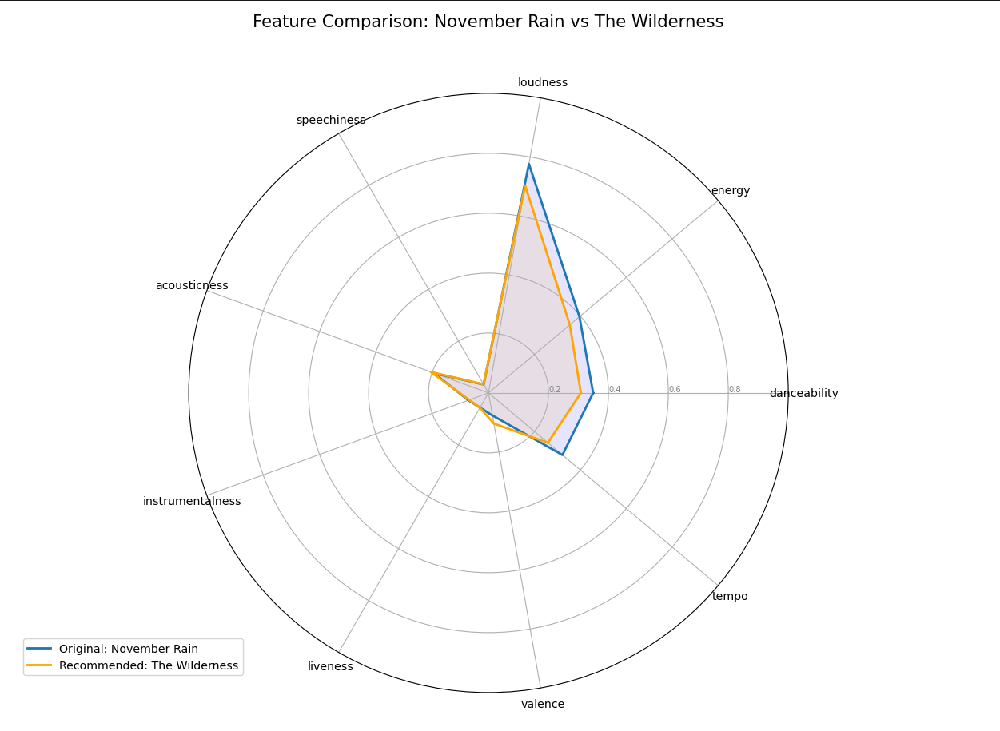

# ShakeIt: Content-Based Music Recommendation Terminal

[](https://www.python.org/)
[](https://scikit-learn.org/)
[](https://opensource.org/licenses/MIT)

**ShakeIt** is a high-performance, terminal-based recommendation engine that analyzes your listening habits to suggest music from a dataset of **114,000+ tracks**. By transforming musical features into a high-dimensional vector space, it calculates your unique "musical vibe" and finds the most similar songs in real-time.

---

## How It Works (Technical Background)

The system treats every song as a 9-dimensional vector using features like *Danceability, Energy, Valence, Acousticness, etc.*

### 1. User Profiling (Centroid Calculation)
The engine calculates a "User Centroid" (average taste vector) by taking the arithmetic mean of all songs in your `listening_history.csv`. This represents the mathematical center of your music taste:

$$\vec{V}_{user} = \frac{1}{n} \sum_{i=1}^{n} \vec{V}_{song, i}$$

### 2. Similarity Discovery
To find the best recommendations, we calculate the **Cosine Similarity** between your profile vector and candidate tracks. Unlike Euclidean distance, this focuses on the "direction" (the vibe) rather than magnitude, ensuring better musical alignment:

$$Similarity(A, B) = \cos(\theta) = \frac{A \cdot B}{\|A\| \|B\|}$$

---

## Key Features

* **Taste Analysis:** Generates personalized recommendations by learning from your history.
* **Search & Play:** Instantly search for any song and open it in your browser (YouTube/Spotify).
* **Feature Visualization:** Compare recommended tracks with your profile using **Radar Charts**.
* **Intelligent Logging:** Automatically tracks your activity to refine future recommendations.
* **Data Pipeline:** Uses `MinMaxScaler` for normalization and `Cosine Similarity` for ranking.

---

## Visualizations

### Radar Chart Analysis
The radar chart below shows the alignment between a user's average profile and a recommended track. It helps visualize which features (like Energy or Acousticness) triggered the recommendation.



---

## Setup

1.  **Clone the Repository:**
    ```bash
    git clone [https://github.com/eminnates/ShakeIt-Music-Recommendation.git](https://github.com/eminnates/ShakeIt-Music-Recommendation.git)
    cd ShakeIt-Music-Recommendation
    ```

2.  **Install Dependencies:**
    ```bash
    pip install -r requirements.txt
    ```

3.  **Prepare Data:**
    Place your `tracks_features.csv` in the root directory.

---

## Usage

Launch the interactive terminal:
```bash
python run.py
